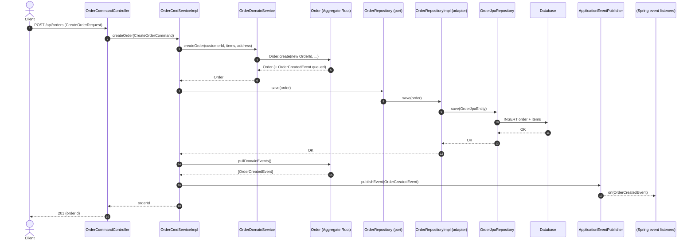
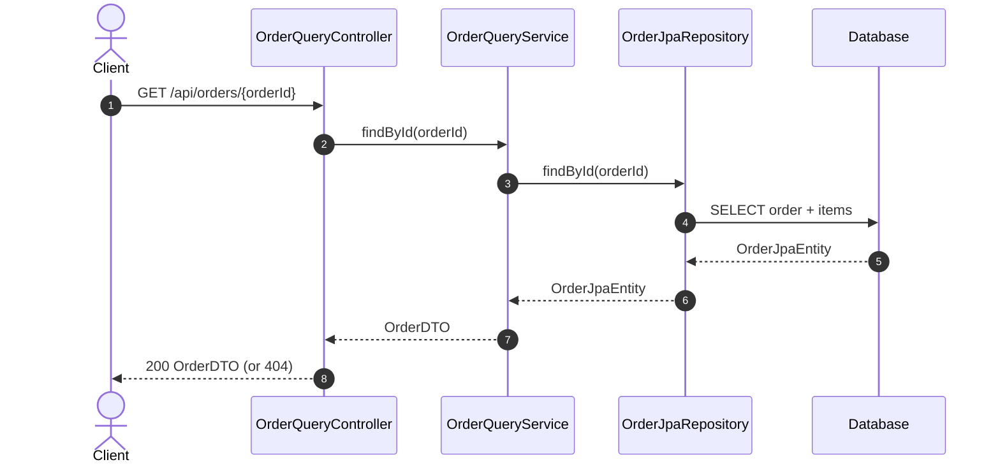

# order-single (DDD + CQRS example)

This module demonstrates a **DDD (Domain-Driven Design)** structure with a lightweight **CQRS** split:

- **Write side** goes through the **domain model** (aggregate + domain service + repository port).
- **Read side** goes through a **query service** that reads from persistence and returns DTOs (bypasses the domain model).

## DDD mapping in this codebase

### Interfaces / Presentation layer

Location: `src/main/java/com/ddd/order/interfaces/rest`

- `OrderCommandController`: HTTP → Commands (write side)
- `OrderQueryController`: HTTP → Query service (read side)

Rule of thumb: controllers should contain **no business logic**.

### Application layer

Location: `src/main/java/com/ddd/order/application`

- Commands: `CreateOrderCommand`, `ConfirmOrderCommand`, `CancelOrderCommand`
- Application service: `OrderCmdServiceImpl`

Responsibilities:

- Orchestrate use-cases (translate command → domain objects)
- Load/save aggregates via repository
- Define transaction boundaries
- Publish domain events after persistence

### Domain layer

Location: `src/main/java/com/ddd/order/domain`

- **Aggregate Root**: `Order`
- **Entities/Value Objects**: `OrderItem`, `Money`, `Address`, `OrderId`, `OrderStatus`
- **Domain Service**: `OrderDomainService` (creation + invariant checks that don’t fit a single entity method)
- **Domain Events**: `OrderCreatedEvent`
- **Repository port**: `OrderRepository` (domain interface)

Key idea: business rules live in the **domain**, not in controllers/services.

### Infrastructure layer

Location: `src/main/java/com/ddd/order/infrastructure`

- Persistence adapter: `OrderRepositoryImpl` implements the domain `OrderRepository`
- JPA entities/repository: `OrderJpaEntity`, `OrderItemJpaEntity`, `OrderJpaRepository`

This layer maps Domain ↔ JPA (an anti-corruption boundary).

## CQRS flows

### Write flow (create order)

### Read flow (query order)

