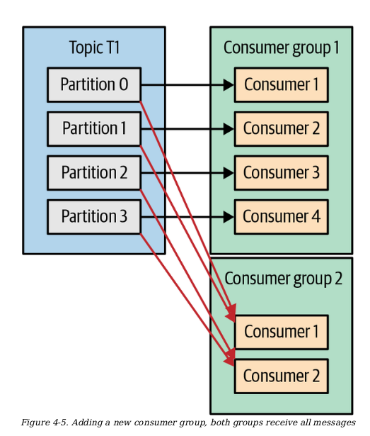
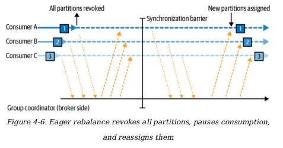
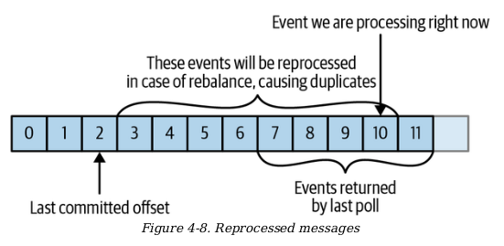

# Kafka consumer group demo (Spring Boot)

This demo shows **consumer groups**, **partition assignment**, and **rebalancing** using 2 Spring Boot apps:

- `producer-service`: REST API to publish messages to Kafka
- `consumer-service`: Kafka listener; run multiple instances with the **same** `groupId` to see partitions split/rebalanced

## Prereqs

- Java 17
- Maven
- Docker + Docker Compose

## Start Kafka locally

From `microservice/kafka`:

```bash
docker compose up -d
```

Kafka UI runs on `http://localhost:8088`.

## Run producer

```bash
cd producer-service
mvn spring-boot:run
```

Producer runs on `http://localhost:8081`.

## Run 2 consumer instances (same group)

Terminal A:

```bash
cd consumer-service
mvn spring-boot:run -Dspring-boot.run.arguments="--server.port=8082"
```

Terminal B (same `groupId`, different `clientId` + port):

```bash
cd consumer-service
mvn spring-boot:run -Dspring-boot.run.arguments="--server.port=8083 --spring.kafka.consumer.client-id=consumer-b"
```

Watch the consumer logs for `partition=...` to see how partitions are assigned, then stop/start one instance to trigger rebalancing.

## Publish messages

```bash
curl -X POST "http://localhost:8081/publish" \
  -H "Content-Type: application/json" \
  -d '{"key":"k1","value":"hello"}'
```

Try different keys to see stable partitioning for the same key.

- Producer Overview
        - Serializer -> convert java obj to []bytes
        - Partition -> key define what partition to go, if null choose partition by round-robin algorithm else hash the key then mapping to a partition 
            how to choose number of partition ? https://www.confluent.io/blog/how-choose-number-topics-partitions-kafka-cluster/
            https://stackoverflow.com/questions/38024514/understanding-kafka-topics-and-partitions
            https://viblo.asia/p/005-bao-nhieu-partition-la-du-cho-mot-topic-trong-apache-kafka-V3m5WQxQZO7
        - Header: add metadata https://www.redpanda.com/guides/kafka-cloud-kafka-headers
        - Interceptor https://oneuptime.com/blog/post/2026-01-30-kafka-interceptors/view
        - Quota and throting Kafka quotas and throttling protect brokers from resource exhaustion by enforcing data throughput (bytes/sec) and request rate (CPU %) limits on producers and consumers. 
- Kafka consumer    
    - Consumer | Consumer Group: 
        - consumer 1 subscribe a topic 1 -> get all messages from all `partitions` in topic 1  
        - if consumer > partitions -> some consumers will get no message at all  
        - We can add 2 consumer groups to handle a topic independently.  
        <br>
        
   - Consumer Groups and Partition Rebalance:
        - Moving partition ownership from one consumer to another
is called a `rebalance` (add consumer, one of consumer in group crashed )
        - eager loading:
                - first cs give up partition assigning
                - cs rejoin group and get new partition assigning
        
        - cooperative rebalances:
                - two or more phase to partially reassign partion to consumer by consumer 
                - consumer sending `heartbeat` to kafka broker (broker as group coordinator) to gc know when it needing rebalance ( in this time, no partition  consumed by dead consumer )
                        - how assign partition to consumer works ? 
                                -  the first consumer join group became the group leader, group leader receive all consumers list from group coordinator -> assign subset of partition to each consumer 
   - Subscribing to Topics 
        ```java
        Properties props = new Properties();
        props.put("bootstrap.servers", "broker1:9092,broker2:9092");
        props.put("group.id", "CountryCounter");
        props.put("key.deserializer",
        "org.apache.kafka.common.serialization.StringDeserializer");
        props.put("value.deserializer",
        "org.apache.kafka.common.serialization.StringDeserializer");
        KafkaConsumer<String, String> consumer =
        new KafkaConsumer<String, String>(props);

        // subscribe to a topic 
        consumer.subscribe(Collections.singletonList("customerCountries"));
        ```
   - The poll loop
        - simple loop for pooling server to get data 
        ```java
        Duration timeout = Duration.ofMillis(100);
        while (true) {
                ConsumerRecords<String, String> records = consumer.poll(timeout);
                for (ConsumerRecord<String, String> record : records) {
                System.out.printf("topic = %s, partition = %d, offset = %d, " +
                "customer = %s, country = %s\n",
                record.topic(), record.partition(), record.offset(),
                record.key(), record.value());
                int updatedCount = 1;
                if (custCountryMap.containsKey(record.value())) {
                updatedCount = custCountryMap.get(record.value()) + 1;
                }
                custCountryMap.put(record.value(), updatedCount);
                }
                }
                JSONObject json = new JSONObject(custCountryMap);
                System.out.println(json.toString());  
        ```
        - thread safety
                - one consumer per thread ( Java ExecutorService )
        - Configuring consumer 
        - Commit and Offsets 
                - When call pool(), we need a way to tracking record were read by consumer of group,
                tracking readed message record by `offset` in each partition 
                https://www.baeldung.com/kafka-commit-offsets
                - last commited offset = 3, message 0 -> 2 already processed, poll() return batch messages ( 7->11 ), current process 10 
                -> on reprocessed or crash, resume on offset 3, 4 -> 10 processed again 

                
        - Rebalance (https://stackoverflow.com/questions/30988002/what-does-rebalancing-mean-in-apache-kafka-context)
        - Deserialize 