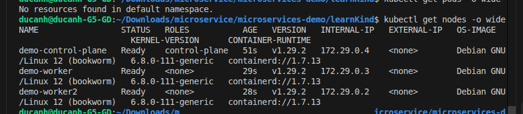
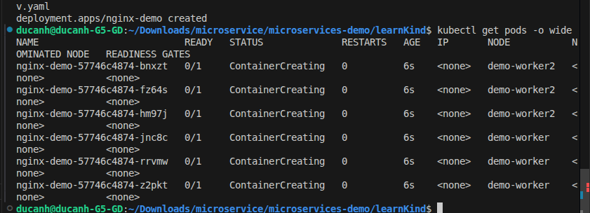
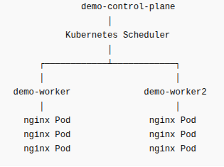
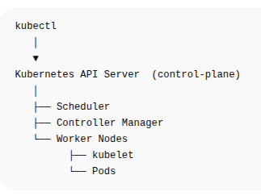
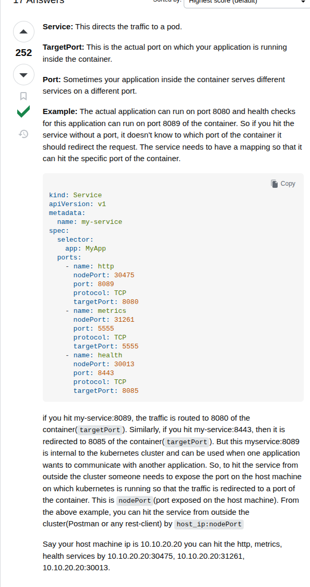
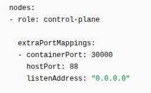
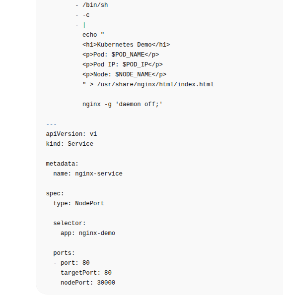
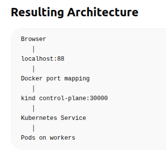
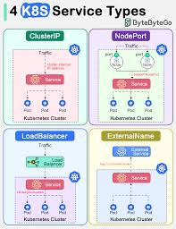
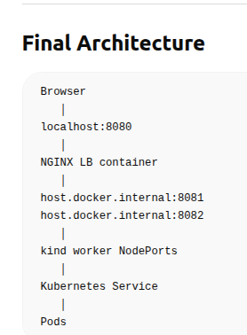

- create control plan, 2 worker node: `kind create cluster --name demo --config kind-config.yaml`
- kubectl get nodes -o wide

- run ex app ex: `kubectl apply -f nginx-dev.yaml`
- 
- Architect 

- woker increase scalability and high availability
- service port 

- nginx-dev.yaml file '---' must be 
- control plane routing request to worker in k8s ( on production add lb first )
    - config here
        
        
        
- k8s service port
    - 

- LB approach 
