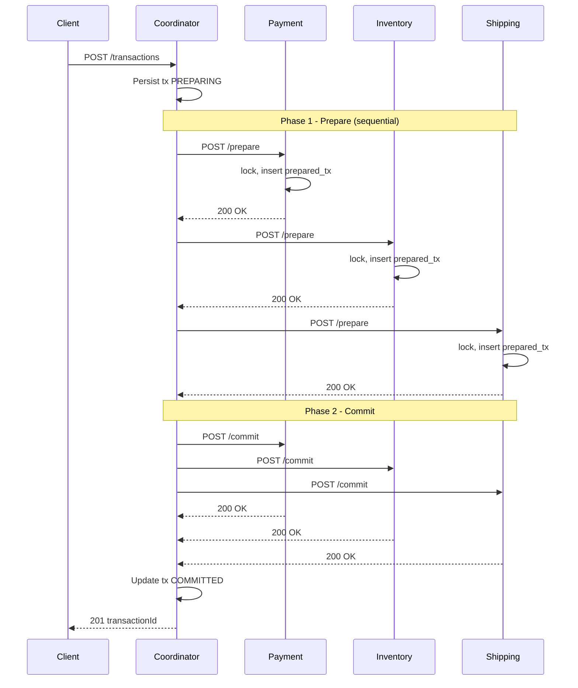
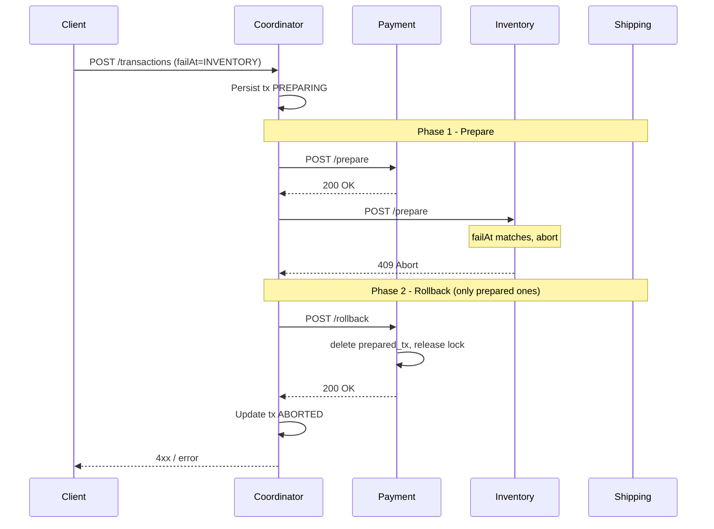

# Saga 2PC - Two-Phase Commit Distributed Transaction Demo

This demo implements the **Two-Phase Commit (2PC)** protocol for distributed transactions across payment, inventory, and shipping services. All participants either commit together or abort together—no compensations.

## Requirements

- Java 17+
- Maven

No Docker/Kafka required—2PC uses synchronous REST.

## 1. Run the services

Start all 4 services in separate terminals (from `saga-2pc/`):

```bash
mvn -pl two-phase-coordinator spring-boot:run
```

```bash
mvn -pl two-phase-payment-service spring-boot:run
```

```bash
mvn -pl two-phase-inventory-service spring-boot:run
```

```bash
mvn -pl two-phase-shipping-service spring-boot:run
```

Ports:
- Coordinator: 8081
- Payment: 8091
- Inventory: 8092
- Shipping: 8093

## 2. Trigger a transaction

### Happy path (all succeed)

```bash
curl -X POST http://localhost:8081/transactions \
  -H 'Content-Type: application/json' \
  -d '{"orderId":"A1","amount":100,"quantity":2,"address":"123 Main St"}'
```

Expected: `201 Created` with `transactionId` and `status: COMMITTED`.

### Failure path (inventory aborts)

```bash
curl -X POST http://localhost:8081/transactions \
  -H 'Content-Type: application/json' \
  -d '{"orderId":"A2","amount":100,"quantity":2,"address":"123 Main St","failAt":"INVENTORY"}'
```

Expected: `409 Conflict` with `status: ABORTED`. Payment is rolled back; no data persisted.

### Other failAt values

- `PAYMENT` — payment prepare fails
- `INVENTORY` — inventory prepare fails
- `SHIPMENT` — shipping prepare fails
- Omit or use `NONE` for success

## 3. Check transaction status

```bash
curl http://localhost:8081/transactions/<transactionId>
```

## Sequence Diagrams

### Happy Path (All Prepare OK → Commit)



### Failure Path (Inventory Aborts → Rollback All)



## 2PC Phases

- **Phase 1 (Prepare)**: Coordinator asks each participant to lock resources and persist a "prepared" state. Participants respond OK or Abort.
- **Phase 2 (Commit/Abort)**: If all said OK, coordinator sends COMMIT; otherwise sends ROLLBACK. Participants finalize or revert.

Participants block (hold locks) from prepare until commit/rollback. 2PC can cause cascading timeouts if a participant is slow or down.

## Comparison: 2PC vs Saga

|                     | 2PC                                     | Saga                                 |
| ------------------- | --------------------------------------- | ------------------------------------ |
| Atomicity           | All commit or all abort                 | Eventually consistent; compensations |
| Blocking            | Yes (participants block until decision) | No (async, eventually consistent)    |
| Coordinator failure | Participants can block indefinitely     | Saga state durable; resume possible  |
| Complexity          | Simpler commit logic                    | Compensations, ordering, idempotency |
| Use case            | Strong consistency, short transactions  | Long-running, cross-domain           |

## Project Structure

```
saga-2pc/
  pom.xml
  shared-contracts/          # DTOs: TransactionRequest, PrepareRequest, CommitRequest, RollbackRequest, FailAt
  two-phase-coordinator/     # REST API, TransactionLog, HTTP client to participants
  two-phase-payment-service/ # Prepare/Commit/Rollback, PreparedTx, PaymentRecord
  two-phase-inventory-service/
  two-phase-shipping-service/
  README.md
```
