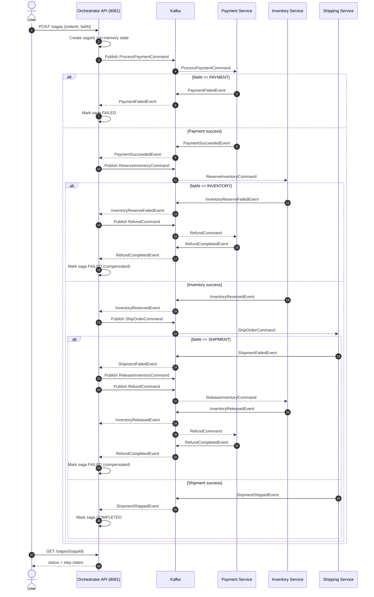
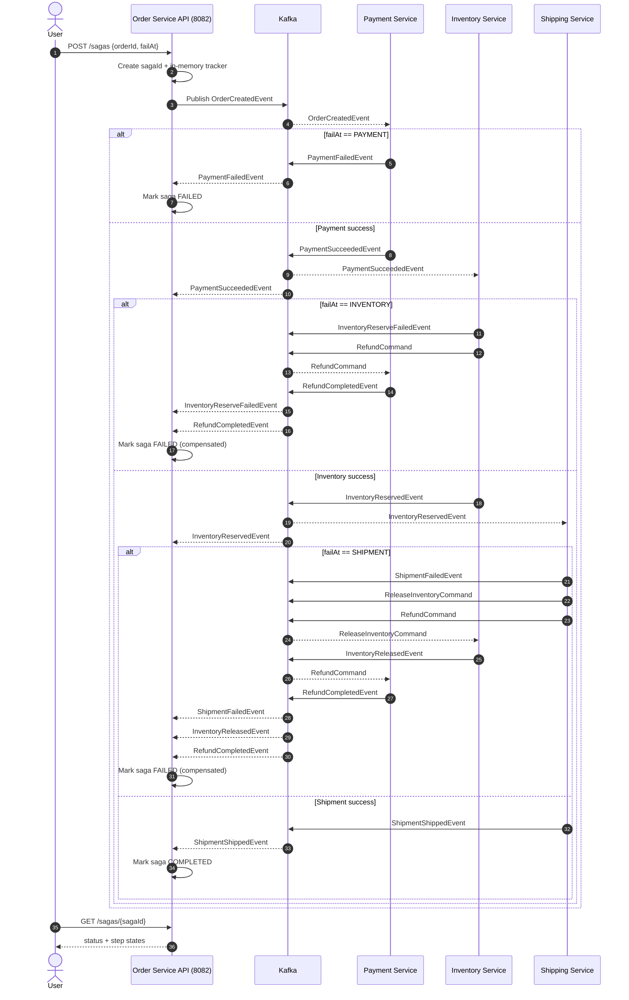

# Saga Demo (Spring Boot + Kafka)

This demo implements the Saga pattern in **two styles**:

- **Orchestration**: a central Saga orchestrator service coordinates steps and triggers compensations.
- **Choreography**: participants react to events and trigger the next step (and compensations) without a central coordinator.

The saga models this flow:

1. Payment
2. Inventory reservation
3. Shipping

Compensations:

- If **inventory reservation** fails after payment succeeds: issue a **refund**
- If **shipping** fails after payment + inventory succeeded: **release inventory** and **refund**

## Requirements

- Java 17+
- Maven
- Docker (to run Kafka)

## 1) Start Kafka

```bash
cd /home/ducanh/Downloads/saga/saga-demo
docker compose up -d
```

Kafka will be available at `localhost:9092`.
Kafka UI will be available at `http://localhost:8088`.

## 2) Run the Orchestration demo

Orchestrator REST API:

- `POST /sagas` (start)
- `GET /sagas/{sagaId}` (status)

Port: `8081`

Start these services in separate terminals (from `saga-demo/`):

```bash
mvn -pl orchestration-orchestrator spring-boot:run
```

```bash
mvn -pl orchestration-payment-service spring-boot:run
```

```bash
mvn -pl orchestration-inventory-service spring-boot:run
```

```bash
mvn -pl orchestration-shipping-service spring-boot:run
```

### Trigger an orchestration saga

```bash
curl -X POST http://localhost:8081/sagas \
  -H 'Content-Type: application/json' \
  -d '{"orderId":"A1","failAt":"INVENTORY"}'
```

Then poll status (replace `<sagaId>` with the returned id):

```bash
curl http://localhost:8081/sagas/<sagaId>
```

Use `failAt` values: `PAYMENT`, `INVENTORY`, `SHIPMENT`.

## 3) Run the Choreography demo

Order service REST API:

- `POST /sagas` (start)
- `GET /sagas/{sagaId}` (status)

Port: `8082`

Start these services in separate terminals (from `saga-demo/`):

```bash
mvn -pl choreography-order-service spring-boot:run
```

```bash
mvn -pl choreography-payment-service spring-boot:run
```

```bash
mvn -pl choreography-inventory-service spring-boot:run
```

```bash
mvn -pl choreography-shipping-service spring-boot:run
```

### Trigger a choreography saga

```bash
curl -X POST http://localhost:8082/sagas \
  -H 'Content-Type: application/json' \
  -d '{"orderId":"B1","failAt":"SHIPMENT"}'
```

Then poll status:

```bash
curl http://localhost:8082/sagas/<sagaId>
```

## Notes

- Kafka topics are auto-created by the broker (`KAFKA_AUTO_CREATE_TOPICS_ENABLE=true`).
- All services connect to Kafka via `KAFKA_BOOTSTRAP_SERVERS` (defaults to `localhost:9092`).
- Use Kafka UI at `http://localhost:8088` to browse topics, inspect messages, and view consumer groups/lag.

## Sequence Diagrams

### Orchestration



### Choreography



