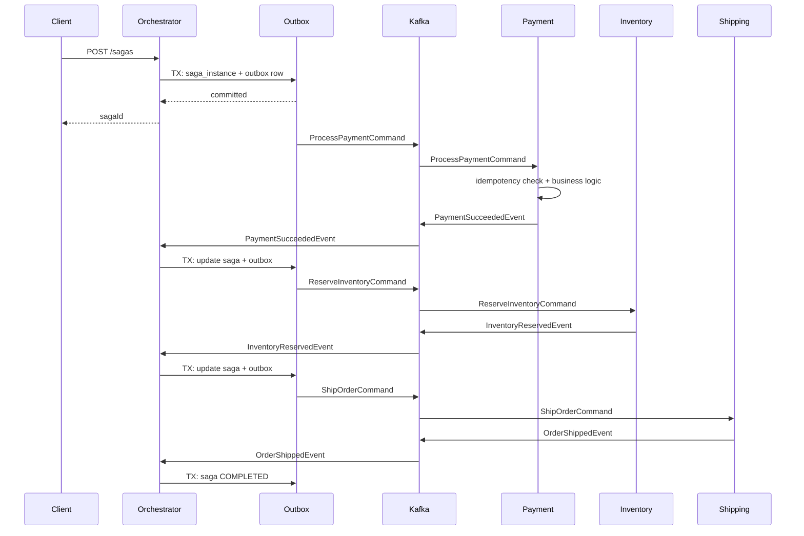
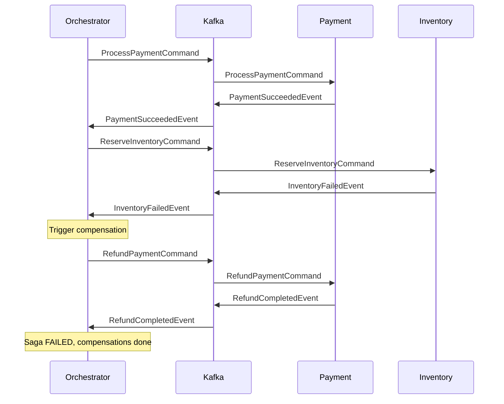

# Saga Distributed Transaction

Saga pattern with stronger guarantees: **transactional outbox**, **idempotency**, and **durable saga state**.

## Features

- **Transactional outbox** – publish to Kafka only after local DB commit (no lost/duplicate messages from TX rollback)
- **Idempotency** – `messageId` on all commands/events; duplicate Kafka delivery is safely ignored
- **Durable saga log** – saga state persisted to DB, survives restarts

## Flow

1. Payment
2. Inventory reservation
3. Shipping

Compensations: inventory fails → refund; shipment fails → release inventory + refund.

## Requirements

- Java 17+
- Maven
- Docker (for Kafka)

## 1. Start Kafka

```bash
cd saga-distributed-tx
docker compose up -d
```

Kafka: `localhost:9092`. Kafka UI: `http://localhost:8088`.

If ports 2181/9092 are already in use (e.g. saga-demo's Kafka), you can reuse that Kafka instance. Ensure it is fully started before running the services.

## 2. Run services

Start in separate terminals (from `saga-distributed-tx/`):

```bash
mvn -pl orchestration-orchestrator spring-boot:run
mvn -pl orchestration-payment-service spring-boot:run
mvn -pl orchestration-inventory-service spring-boot:run
mvn -pl orchestration-shipping-service spring-boot:run
```

Ports: Orchestrator 8081, Payment 8091, Inventory 8092, Shipping 8093.

## 3. Trigger a saga

```bash
curl -X POST http://localhost:8081/sagas \
  -H 'Content-Type: application/json' \
  -d '{"orderId":"A1","failAt":"NONE"}'
```

Then poll status (replace `<sagaId>` with the returned id):

```bash
curl http://localhost:8081/sagas/<sagaId>
```

**failAt** values: `PAYMENT`, `INVENTORY`, `SHIPMENT` (or `NONE` for success).

## Sequence Diagrams

### Happy Path (Payment → Inventory → Shipping)



### Failure Path (Inventory fails → Refund compensation)



## Comparison with saga-demo

| Feature              | saga-demo       | saga-distributed-tx           |
|----------------------|-----------------|-------------------------------|
| Saga state           | In-memory       | Durable (DB)                  |
| Publishing           | Direct to Kafka | Transactional outbox          |
| Duplicate messages   | May reprocess   | Idempotent (messageId)        |
| Restart resilience   | State lost      | State survives, resume works  |

## Topic prefix

`saga.distributed.*` – distinct from `saga.orchestration.*` used by saga-demo.

## Project structure

```
saga-distributed-tx/
  pom.xml
  docker-compose.yml
  shared-contracts/          # DTOs with messageId, topic constants
  orchestration-orchestrator/  # REST, SagaInstance, Outbox, OutboxPublisher
  orchestration-payment-service/
  orchestration-inventory-service/
  orchestration-shipping-service/
  README.md
```
